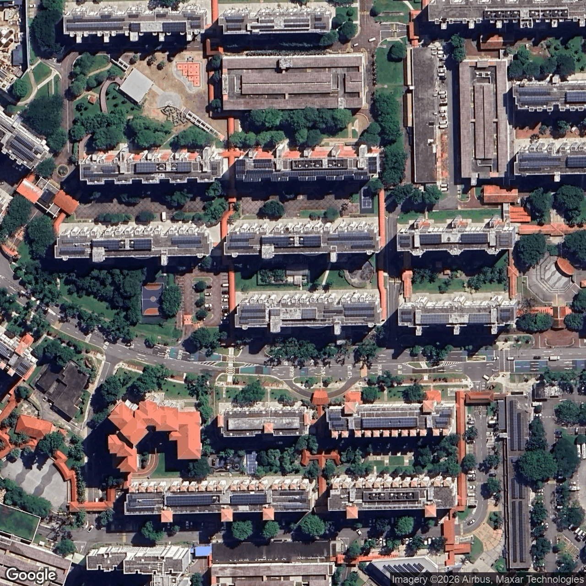
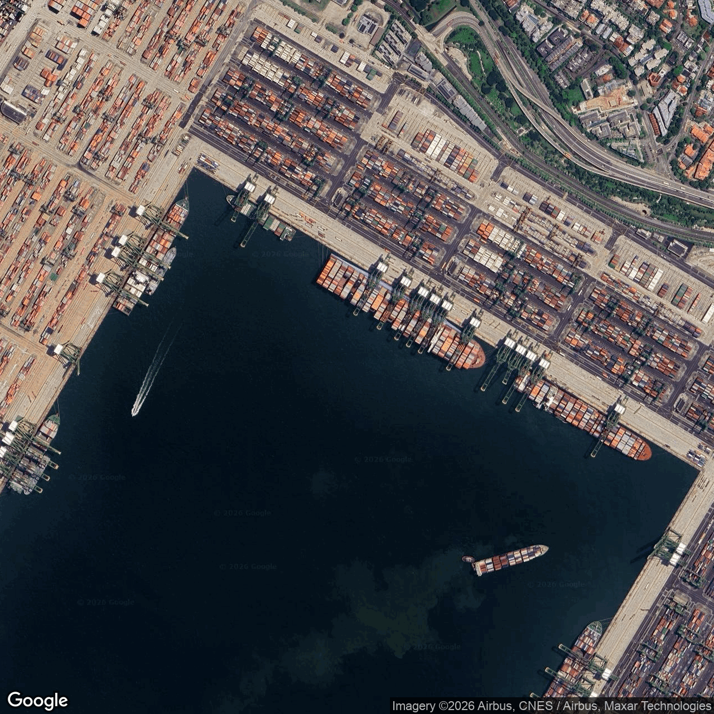
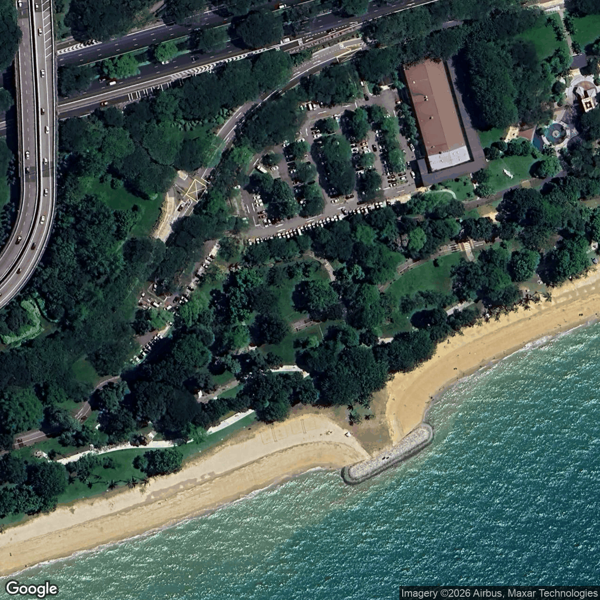
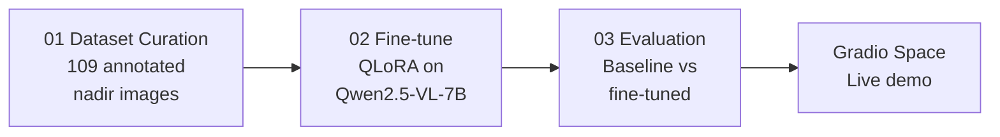

# Aerial Scene Analyser

**Domain Adaptation for Singapore Urban Aerial Imagery**

Fine-tuned a vision-language model to recognise Singapore-specific urban features in aerial imagery — from custom dataset curation to multi-metric evaluation.

**[Live Demo](https://huggingface.co/spaces/kaihon/sg-aerial-scene-analyser)** · **[Model Card](https://huggingface.co/kaihon/sg-aerial-scene-analyser-lora)**

<p align="center">
  
  
  
</p>

## Demo

https://github.com/user-attachments/assets/4e606d36-03f8-4c96-8fff-fa8455a6a6f6

## Highlights

- **QLoRA fine-tuning** of Qwen2.5-VL-7B (4-bit NF4 quantization) to ground aerial descriptions in Singapore-specific vocabulary — HDB estates, hawker centres, MRT infrastructure, covered walkways.
- **Custom dataset** of 109 annotated nadir aerial images spanning 9 scene types, with a structured JSON schema and LLM-assisted annotation pipeline with manual verification.
- **Custom training pipeline** built with HuggingFace Transformers, TRL, and PEFT — handling dynamic-resolution image tiling, visual token padding, and assistant-only label masking.

## Pipeline



## Results (17-sample held-out test set)

| Metric | Baseline | Fine-tuned | Delta |
|--------|----------|------------|-------|
| Schema Compliance | 100.0% | 100.0% | — |
| Scene Type Accuracy | 52.9% | 70.6% | +17.7% |
| ROUGE-1 F1 | 0.325 | 0.536 | +0.211 |
| ROUGE-2 F1 | 0.040 | 0.268 | +0.228 |
| ROUGE-L F1 | 0.193 | 0.402 | +0.209 |
| BERTScore F1 | 0.875 | 0.917 | +0.042 |
| Object Mention F1 | 0.309 | 0.471 | +0.161 |

Fine-tuning improves scene classification by +17.7%, doubles caption quality (ROUGE-L +0.21), and boosts object detection (F1 +0.16) while grounding descriptions in Singapore-specific vocabulary.

## Project Structure

```
vlm-scene-analyser/
├── src/                            # Shared Python modules
│   ├── prompts.py                  #   System & user prompts
│   ├── inference.py                #   Model loading, inference, JSON parsing
│   ├── evaluation.py               #   Metrics (ROUGE, BERTScore, Object F1)
│   ├── collator.py                 #   Multimodal data collator for Qwen2.5-VL
│   └── augmentation.py             #   Rotation + flip augmentation for nadir images
├── configs/
│   └── train_config.yaml           # Hyperparameters, model IDs, paths
├── notebooks/
│   ├── 01_dataset_curation.ipynb   # Image collection + annotation pipeline
│   ├── 02_finetune.ipynb           # QLoRA fine-tuning with SFTTrainer
│   └── 03_evaluation.ipynb         # Baseline vs fine-tuned comparison
├── data/
│   └── annotations.jsonl           # 109 structured annotations
├── samples/                        # Sample images for README
└── pyproject.toml
```

## Approach

### 1. Dataset Curation

Built a structured annotation pipeline:
- 109 nadir aerial images captured across Singapore via Google Maps Static API
- 9 scene types: `residential_hdb`, `commercial`, `mixed_use`, `park_green`, `transport`, `industrial`, `port_terminal`, `construction`, `airport`
- JSON schema per image: `caption`, `scene_type`, `objects` (with counts), `infrastructure`, `terrain`
- LLM-assisted initial annotation with manual verification and correction

### 2. QLoRA Fine-Tuning

Fine-tuned Qwen2.5-VL-7B-Instruct using:
- **4-bit NF4 quantization** (BitsAndBytes) — 8.1 GB model footprint
- **LoRA adapters** (r=8, alpha=16) on language model linear layers only — 23.8M trainable params (0.29%)
- **Custom data collator** handling Qwen2.5-VL's two-step processor pattern with `process_vision_info()` for dynamic image tiling
- **Assistant-only label masking** — loss computed only on JSON response tokens, not prompt/image tokens
- **On-the-fly augmentation** — random rotation + flip for orientation-invariant nadir imagery
- Stratified 70/15/15 train/val/test split with rare class grouping

### 3. Evaluation

Multi-metric comparison of baseline vs fine-tuned on held-out test set: JSON Schema Compliance, Scene Type Accuracy, ROUGE-1/2/L, BERTScore, and custom Object Mention F1.

## Annotation Schema

Each image is annotated with a structured JSON object:

```json
{
  "caption": "Dense HDB estate viewed from above. Approximately 20 slab and point blocks with grey rooftops are arranged in rows across the frame. Several point blocks feature oval rooftop structures. Sports courts with blue surfaces and multi-storey car parks are visible within the estate, and some blocks have rooftop solar panels.",
  "scene_type": "residential_hdb",
  "objects": [{"type": "hdb_block", "count": 20}, {"type": "sports_facility", "count": 1}],
  "infrastructure": ["covered_walkway"],
  "terrain": ["urban"]
}
```

## Tech Stack

| Component | Tool |
|-----------|------|
| Base model | [Qwen2.5-VL-7B-Instruct](https://huggingface.co/Qwen/Qwen2.5-VL-7B-Instruct) |
| Fine-tuning | QLoRA via [PEFT](https://github.com/huggingface/peft) + [TRL](https://github.com/huggingface/trl) `SFTTrainer` |
| Quantization | [BitsAndBytes](https://github.com/bitsandbytes-foundation/bitsandbytes) NF4 |
| Framework | [HuggingFace Transformers](https://github.com/huggingface/transformers) ≥ 4.49 |
| Compute | Google Colab Pro (L4 24GB) |
| Demo | [Gradio](https://gradio.app) on [HuggingFace Spaces](https://huggingface.co/spaces/kaihon/sg-aerial-scene-analyser) |

## Reproduce

Notebooks are designed for Google Colab with GPU. Source imagery is not included due to licensing:

1. Coordinates for all 109 locations are in `notebooks/01_dataset_curation.ipynb`
2. Download nadir imagery via Google Maps Static API at zoom levels 15–18, scale 2 (1280×1280 px)
3. Annotations are provided in `data/annotations.jsonl`
