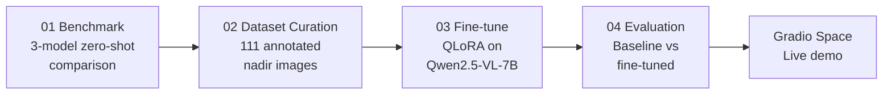

# Aerial Scene Analyser

**Domain Adaptation for Singapore Urban Aerial Imagery**

Fine-tuned a vision-language model to recognise Singapore-specific urban features in aerial imagery — from custom dataset curation to multi-metric evaluation.

**[Live Demo](https://huggingface.co/spaces/kaihon/sg-aerial-scene-analyser)** · **[Model Card](https://huggingface.co/kaihon/sg-aerial-scene-analyser-lora)**

<p align="center">
  
  
  
</p>

## Demo

<!-- TODO: Replace with actual demo video/gif -->
<p align="center">
  <a href="https://huggingface.co/spaces/kaihon/sg-aerial-scene-analyser">
    
  </a>
</p>

## Highlights

- **QLoRA fine-tuning** of Qwen2.5-VL-7B (4-bit NF4 quantization) to ground aerial descriptions in Singapore-specific vocabulary — HDB estates, hawker centres, MRT infrastructure, covered walkways.
- **Custom dataset** of 111 annotated nadir aerial images spanning 10 scene types, with a structured JSON schema and LLM-assisted annotation pipeline with manual verification.
- **3-model VLM benchmark** (Qwen2.5-VL, LLaVA-OneVision, GLM-4.1V) identifying vocabulary gaps that informed the fine-tuning strategy.
- **Custom training pipeline** built with HuggingFace Transformers, TRL, and PEFT — handling dynamic-resolution image tiling, visual token padding, and assistant-only label masking.

## Pipeline



## Results (17-sample held-out test set)

| Metric | Baseline | Fine-tuned | Delta |
|--------|----------|------------|-------|
| Schema Compliance | 100.0% | 100.0% | — |
| Scene Type Accuracy | 76.5% | 76.5% | — |
| ROUGE-1 F1 | 0.334 | 0.556 | +0.222 |
| ROUGE-2 F1 | 0.049 | 0.235 | +0.186 |
| ROUGE-L F1 | 0.194 | 0.386 | +0.192 |
| BERTScore F1 | 0.877 | 0.914 | +0.037 |
| Object Mention F1 | 0.295 | 0.395 | +0.100 |

Fine-tuning nearly doubles caption quality (ROUGE-L +0.19) and improves object detection (F1 +0.10) while adopting Singapore-specific vocabulary. Scene type accuracy holds steady at 76.5%.

## Project Structure

```
vlm-scene-analyser/
├── src/                            # Shared Python modules
│   ├── prompts.py                  #   System & user prompts
│   ├── inference.py                #   Model loading, inference, JSON parsing
│   ├── evaluation.py               #   Metrics (ROUGE, BERTScore, Object F1)
│   ├── collator.py                 #   Multimodal data collator for Qwen2.5-VL
│   └── augmentation.py             #   Rotation + flip augmentation for nadir images
├── configs/
│   └── train_config.yaml           # Hyperparameters, model IDs, paths
├── notebooks/
│   ├── 01_benchmark.ipynb          # 3-model zero-shot VLM benchmark
│   ├── 02_dataset_curation.ipynb   # Image collection + annotation pipeline
│   ├── 03_finetune.ipynb           # QLoRA fine-tuning with SFTTrainer
│   └── 04_evaluation.ipynb         # Baseline vs fine-tuned comparison
├── data/
│   ├── annotations.jsonl           # 111 structured annotations
│   └── annotations/                # Per-image JSON files
├── samples/                        # Sample images for README
└── pyproject.toml
```

## Approach

### 1. Baseline Benchmarking

Evaluated three open-source VLMs on Singapore aerial imagery in a zero-shot setting. Models consistently failed to produce Singapore-specific terms (HDB, hawker centre), defaulting to generic descriptions — zero mentions of "HDB" across 129 outputs.

### 2. Dataset Curation

Built a structured annotation pipeline:
- 111 nadir aerial images captured across Singapore via Google Maps Static API
- 10 scene types: `residential_hdb`, `commercial`, `mixed_use`, `park_green`, `transport`, `industrial`, `port_terminal`, `construction`, `airport`, `waterway`
- JSON schema per image: `caption`, `scene_type`, `objects` (with counts), `infrastructure`, `terrain`
- LLM-assisted initial annotation with manual verification and correction

### 3. QLoRA Fine-Tuning

Fine-tuned Qwen2.5-VL-7B-Instruct using:
- **4-bit NF4 quantization** (BitsAndBytes) — 8.1 GB model footprint
- **LoRA adapters** (r=8, alpha=16) on language model linear layers only — 23.8M trainable params (0.29%)
- **Custom data collator** handling Qwen2.5-VL's two-step processor pattern with `process_vision_info()` for dynamic image tiling
- **Assistant-only label masking** — loss computed only on JSON response tokens, not prompt/image tokens
- **On-the-fly augmentation** — random rotation + flip for orientation-invariant nadir imagery
- Stratified 70/15/15 train/val/test split with rare class grouping

### 4. Evaluation

Multi-metric comparison of baseline vs fine-tuned on held-out test set: JSON Schema Compliance, Scene Type Accuracy, ROUGE-1/2/L, BERTScore, and custom Object Mention F1.

## Annotation Schema

Each image is annotated with a structured JSON object:

```json
{
  "caption": "Dense HDB estate viewed from above. Rows of long rectangular ...",
  "scene_type": "residential_hdb",
  "objects": [{"type": "hdb_block", "count": 20}, {"type": "hawker_centre", "count": 1}],
  "infrastructure": ["covered_walkway", "mrt_track"],
  "terrain": ["urban", "parkland"]
}
```

## Tech Stack

| Component | Tool |
|-----------|------|
| Base model | [Qwen2.5-VL-7B-Instruct](https://huggingface.co/Qwen/Qwen2.5-VL-7B-Instruct) |
| Fine-tuning | QLoRA via [PEFT](https://github.com/huggingface/peft) + [TRL](https://github.com/huggingface/trl) `SFTTrainer` |
| Quantization | [BitsAndBytes](https://github.com/bitsandbytes-foundation/bitsandbytes) NF4 |
| Framework | [HuggingFace Transformers](https://github.com/huggingface/transformers) ≥ 4.49 |
| Compute | Google Colab Pro (L4 24GB) |
| Demo | [Gradio](https://gradio.app) on [HuggingFace Spaces](https://huggingface.co/spaces/kaihon/sg-aerial-scene-analyser) |

## Getting Started

```bash
git clone https://github.com/kaihon/vlm-scene-analyser.git
cd vlm-scene-analyser

# Base dependencies (data curation, local development)
pip install .

# Training dependencies (GPU required)
pip install ".[train]"

# Evaluation dependencies (GPU required)
pip install ".[eval]"
```

Notebooks are designed to run on Google Colab with GPU. They import shared logic from `src/` via:
```python
sys.path.insert(0, "/content/drive/MyDrive/vlm-scene-analyser")
from src.inference import load_model, run_inference
```

## Dataset

Source imagery is not included in this repository due to licensing constraints. To reproduce:

1. Coordinates for all 111 locations are listed in `notebooks/02_dataset_curation.ipynb`
2. Download nadir imagery via Google Maps Static API at zoom level 18, scale 2 (1280×1280 px)
3. Annotations are provided in `data/annotations.jsonl`
