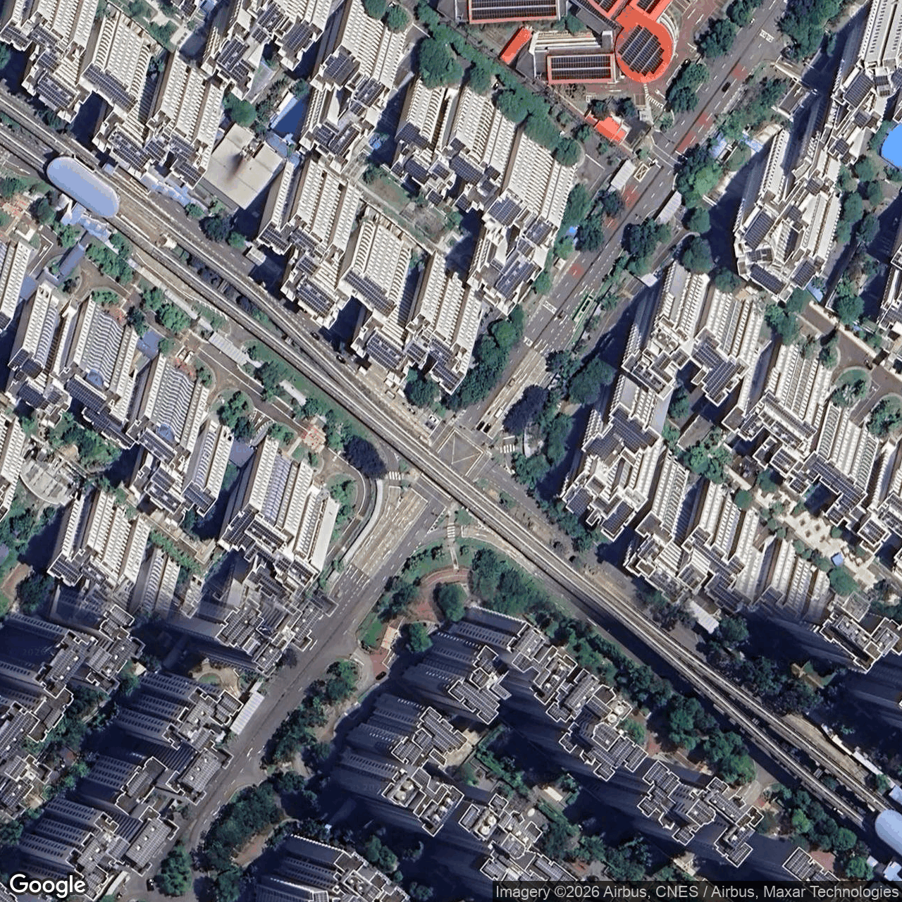
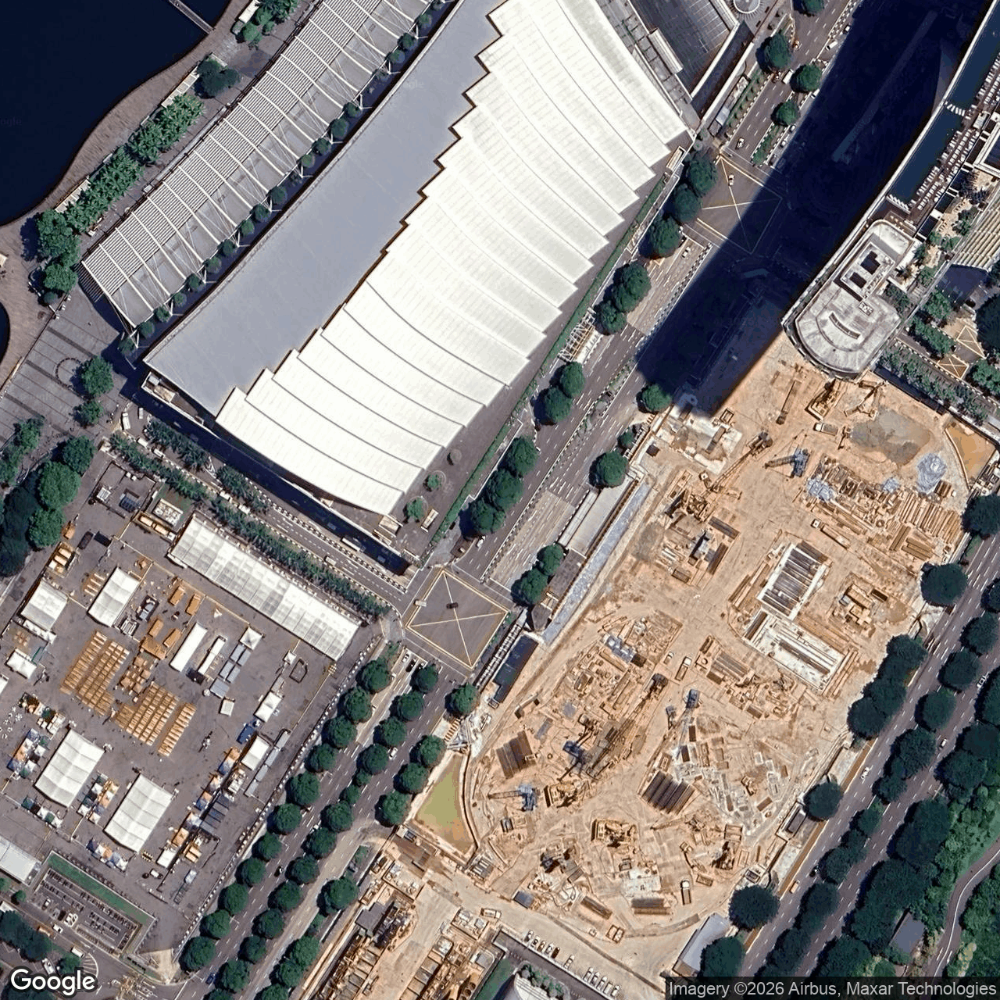
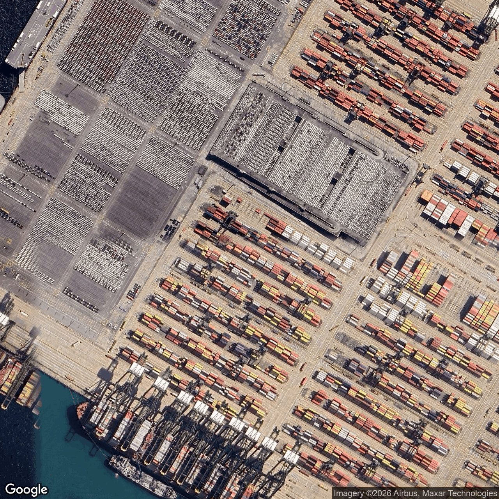
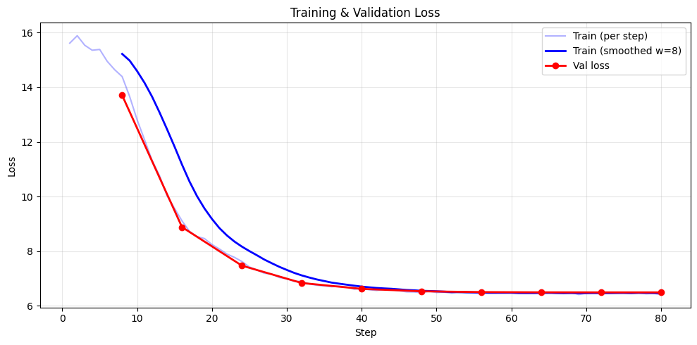

# Aerial Scene Analyser

**Domain Adaptation for Singapore Urban Aerial Imagery**

Fine-tuned a vision-language model to recognise Singapore-specific urban features in aerial imagery — from custom dataset curation to multi-metric evaluation.

<p align="center">
  
  
  
</p>

## Highlights

- **QLoRA fine-tuning** of Qwen2.5-VL-7B (4-bit NF4 quantization) to ground aerial descriptions in Singapore-specific vocabulary — HDB estates, hawker centres, MRT infrastructure, void decks, covered walkways.
- **Custom dataset** of annotated Singapore nadir aerial images spanning 12 scene types, with a structured JSON schema and LLM-assisted annotation pipeline with manual verification.
- **3-model VLM benchmark** (Qwen2.5-VL, LLaVA-OneVision, GLM-4.1V) evaluated with quantitative metrics (ROUGE-L, BERTScore, custom Object Mention F1), identifying vocabulary gaps that informed the fine-tuning strategy.
- **Custom training pipeline** built with HuggingFace Transformers, TRL, and PEFT — handling dynamic-resolution image tiling, visual token padding, and assistant-only label masking.

## Project Structure

```
├── data/
│   ├── annotations.jsonl          # Structured annotations (12 scene types)
│   └── coordinates.csv            # Image geolocation metadata
├── samples/                       # Sample images for illustration
├── notebooks/
│   ├── 01_baseline_benchmark.ipynb    # 3-model zero-shot VLM benchmark on Singapore images
│   ├── 02_dataset_curation.ipynb      # LLM-assisted annotation pipeline
│   ├── 03_finetune_qwen.ipynb         # QLoRA fine-tuning pipeline + training results
│   └── 04_evaluation.ipynb            # Quantitative evaluation (ROUGE-L, BERTScore, Object F1)
├── pyproject.toml
└── README.md
```

## Approach

### 1. Baseline Benchmarking

Evaluated three open-source VLMs on Singapore aerial imagery in a zero-shot setting to identify domain-specific vocabulary gaps. Models consistently failed to produce Singapore-specific terms (HDB, void deck, hawker centre), defaulting to generic descriptions.

### 2. Dataset Curation

Built a structured annotation pipeline:
- Nadir aerial images captured across Singapore
- 12 scene types: `residential_hdb`, `commercial_cbd`, `mixed_use`, `park_green`, `transport_hub`, `industrial`, `port_terminal`, `construction`, `airport`, `military`, `residential_private`, `waterway`
- JSON schema per image: `caption`, `scene_type`, `analysis` (objects with counts, infrastructure, terrain, notable features)
- LLM-assisted initial annotation with manual verification and correction

### 3. QLoRA Fine-Tuning

Fine-tuned Qwen2.5-VL-7B-Instruct using:
- **4-bit NF4 quantization** (BitsAndBytes) — 8.1 GB model footprint
- **LoRA adapters** (r=8, alpha=16) on language model linear layers only — 23.8M trainable params (0.29%)
- **Custom data collator** handling Qwen2.5-VL's two-step processor pattern with `process_vision_info()` for dynamic image tiling
- **Assistant-only label masking** — loss computed only on JSON response tokens, not prompt/image tokens
- Stratified 70/15/15 train/val/test split with rare class grouping

### 4. Evaluation

- Training/validation loss curves with early stopping
- Qualitative side-by-side comparison (ground truth vs. prediction) on held-out validation set
- Quantitative metrics on held-out test set: JSON Schema Compliance, Scene Type Accuracy, ROUGE-L, BERTScore, custom Object Mention F1 with per-category breakdown

<p align="center">
  
</p>

## Tech Stack

| Component | Tool |
|-----------|------|
| Base model | [Qwen2.5-VL-7B-Instruct](https://huggingface.co/Qwen/Qwen2.5-VL-7B-Instruct) |
| Fine-tuning | QLoRA via [PEFT](https://github.com/huggingface/peft) + [TRL](https://github.com/huggingface/trl) `SFTTrainer` |
| Quantization | [BitsAndBytes](https://github.com/bitsandbytes-foundation/bitsandbytes) NF4 |
| Framework | [HuggingFace Transformers](https://github.com/huggingface/transformers) ≥ 4.49 |
| Compute | Google Colab (GPU) |
| Data | [HuggingFace Datasets](https://github.com/huggingface/datasets), scikit-learn |

## Getting Started

```bash
# Clone the repository
git clone https://github.com/<username>/vlm-scene-analyser.git
cd vlm-scene-analyser

# Install dependencies
pip install -r requirements.txt
# or
pip install "transformers>=4.49" peft "trl>=0.15" bitsandbytes qwen-vl-utils accelerate datasets scikit-learn matplotlib

# Run notebooks in order on Google Colab (GPU required)
```

## Dataset

Source imagery is not included in this repository due to licensing constraints. To reproduce the full dataset:

1. Use `data/coordinates.csv` to obtain image locations (latitude, longitude, scene type)
2. Download nadir imagery via Google Maps Static API at zoom level 18-19
3. Annotations are provided in `data/annotations.jsonl`

## Annotation Schema

Each image is annotated with a structured JSON object:

```json
{
  "caption": "Punggol HDB estate viewed from above, showing ...",
  "scene_type": "residential_hdb",
  "analysis": {
    "objects": [{"type": "hdb_block", "count": 8}, {"type": "mrt_station", "count": 1}],
    "infrastructure": ["mrt_line", "road_network", "covered_walkway"],
    "terrain": ["urban", "parkland", "water"],
    "notable": "Waterfront HDB town with distinctive ..."
  }
}
```
